1. Поток это...

    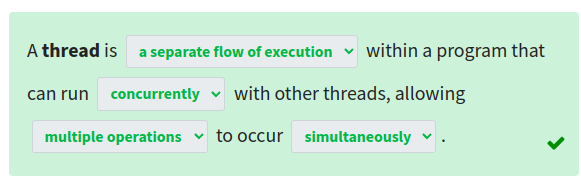
2. Для чего применяется `threading.Lock`?

    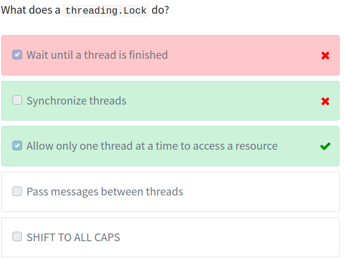
3. Сколько ЦПУ (или ядер) будет использовать `threading`?

    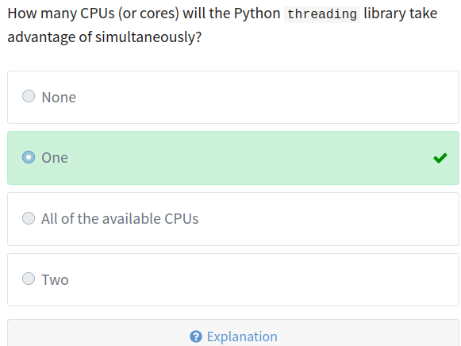
4. Что делает метод `Thread.join()`?

    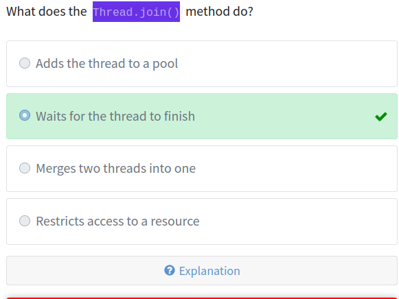
5. Состояние гонки это...

    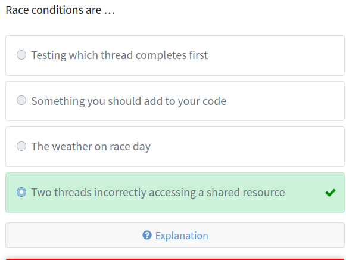
6. Почему желательно при возможности использовать `ThreadPoolExecutor`?

    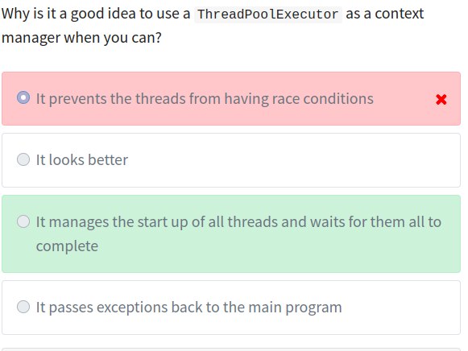
7. Можно ли остановить `threading.Timer` после его запуска пока он не истек?

    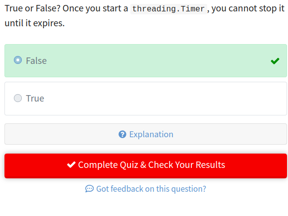

8. Какое самое распространенное применение сокетов?

    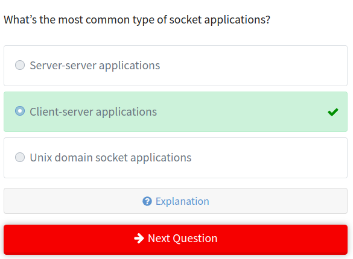
9. К какому протоколу предоставляет доступ `socket` в Пайтон?

    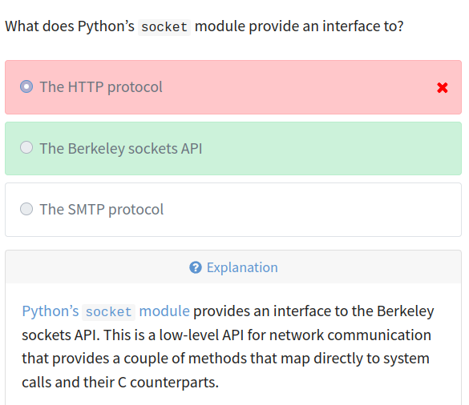
10. Для чего применяется метод `.bind()`?
11. Для чего применяется метод `.listen()`?
12. Для чего применяется метод `.accept()`?

    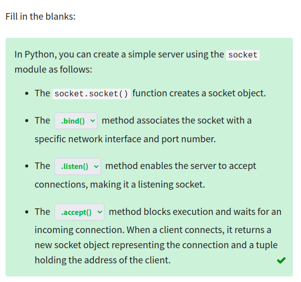
13. Рассмотрим следующий код для клиента:
    ```py
    import socket

    HOST = "127.0.0.1"
    PORT = 65432

    with socket.socket(socket.AF_INET, socket.SOCK_STREAM) as s:
        s.connect((HOST, PORT))
        s.sendall(b"Hello, world")
        data = s.recv(1024)

    print(f"Received {data!r}")
    ```

    Что делает данный скрипт?

    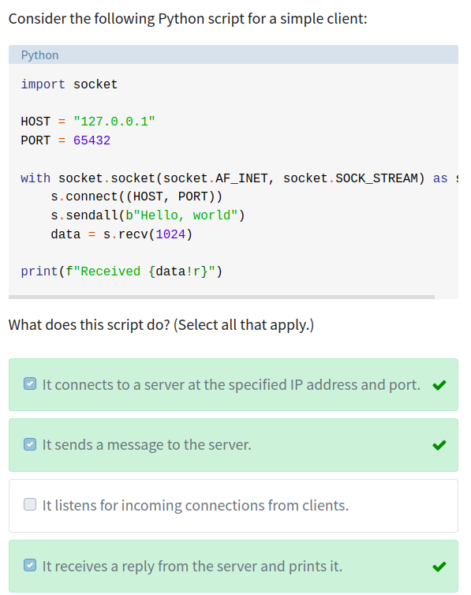
14. Какой метод используется для проверки завершения ввода/вывода более чем на одном сокете?

    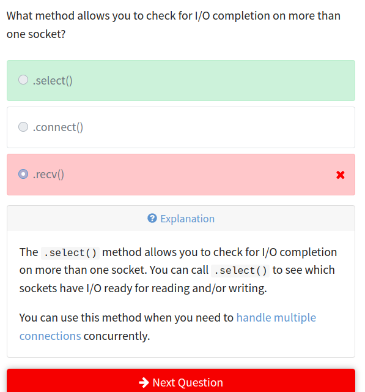
15. Для чего используется подзаголовок `content-type` в словаре заголовков протокола?

    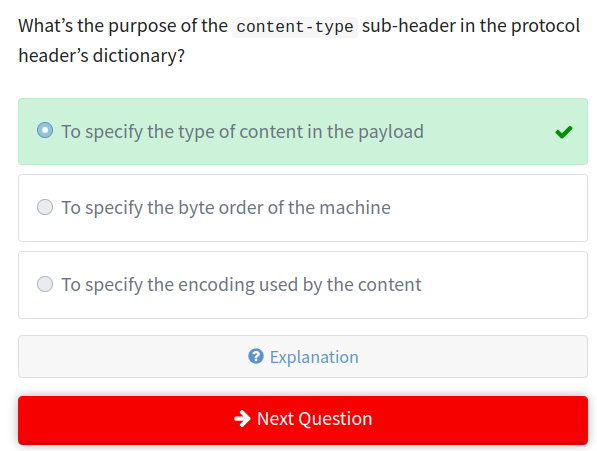
16. Какой IP-адресс необходимо указать, чтобы сервер "слушал" на всех интерфейсах?

    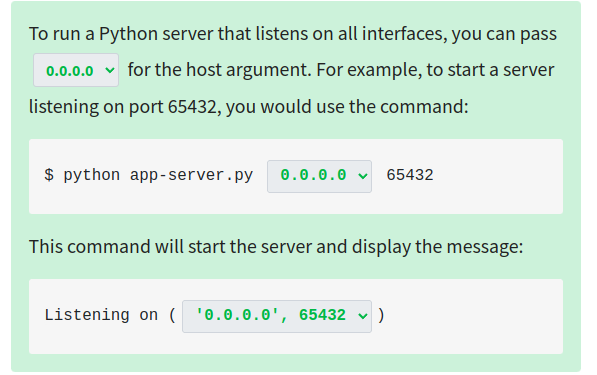
17. Какой протокол использует команда `ping` для проверки хоста и его подключения к сети?

    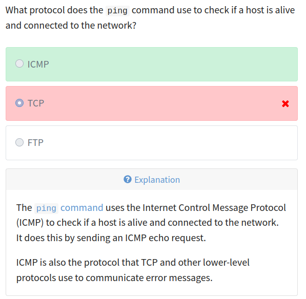

18. Что такое CSV-файл?

    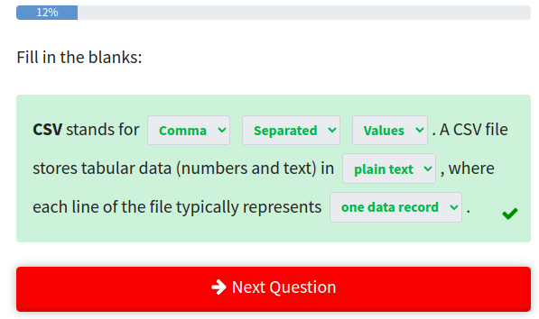
19. Какие разделители используются в `.csv` и `.tsv` файлах?

    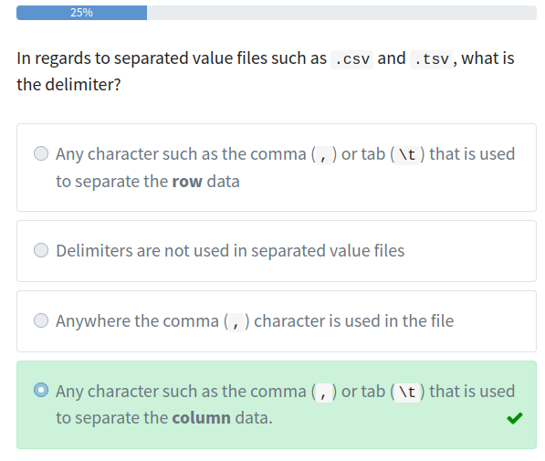
20. Что обычно содержится в первой строке `.csv` и `.tsv` файлов?

    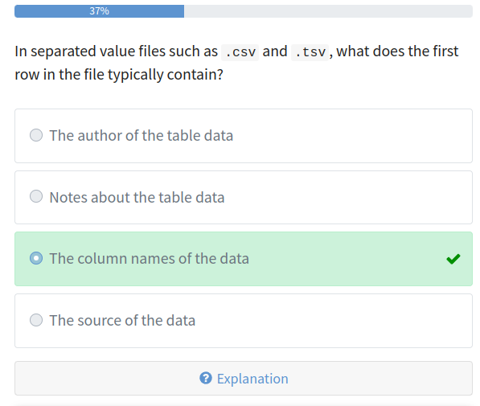
21. Допустим, есть объект `my_data`, в котором правильно открытый файл с табуляцией в качестве разделителя.

    Как правильно открыть файл используя модуль `csv` и присвоить его переменной `csv_reader`?

    Пусть модуль `csv` уже импортирован.

    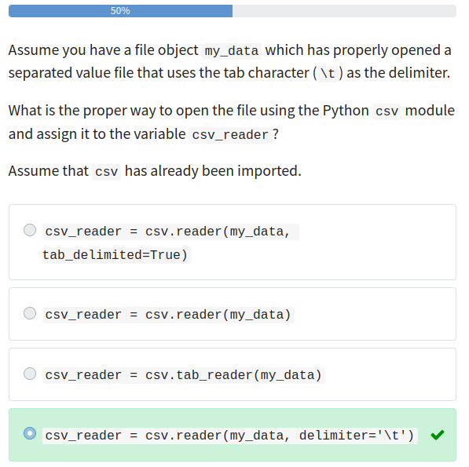
22. Что будет содержаться в `item` в процессе выполнения следующего кода? 
    ```py
    for item in csv_reader:
        print(item)
    ```
    `csv_reader` - объект класса `csv.reader()`
    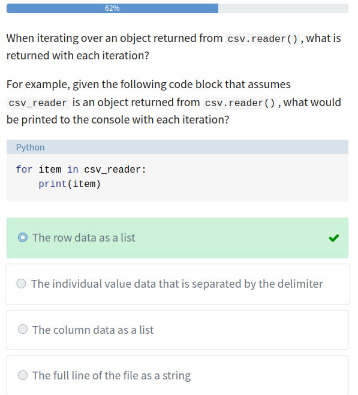
23. При записи в CSV файл используя метод .writerow() объекта csv.DictWriter, чем должны быть ключи передаваемого словаря? Пример:

    ```py
    with open('test_file.csv', mode='w') as csv_file:

        writer = csv.DictWriter(
            csv_file, 
            fieldnames=['first_col', 'second_col']
        )
        writer.writeheader()

        # This input dictionary is what the question is referring
        # to and is not necessarily correct as shown.
        writer.writerow({'key1':'value1', 'key2':'value2'})
    ```

    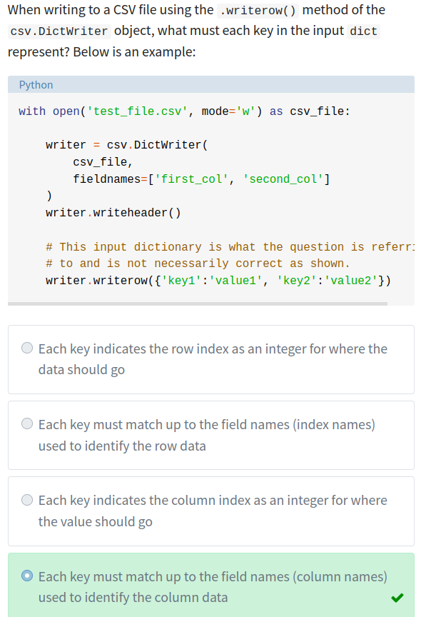

24. Как правильно открыть CSV файл `hrdata.csv` для чтения пакетом `pandas`?

    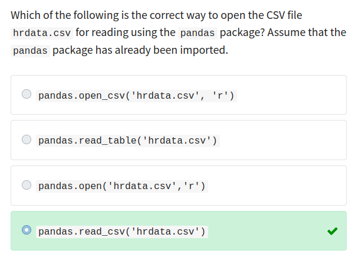
25. По-умолчанию, `pandas` индексирует строки по порядку. Какие правильные способы есть, чтобы использовать столбец `Name` в качестве индекса? Пример содержимого файла:

    ```
    Name,Hire Date,Salary,Sick Days remaining
    Fred,10/10/10,10000,10
    ```

    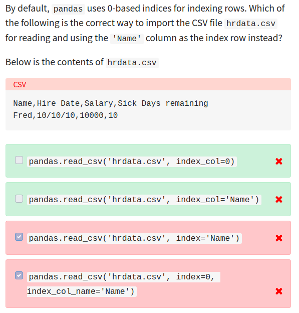 

25. Что такое JSON?
26. Что такое сериализация JSON?
27. Что такое десериализация JSON?
28. Для чего используется метод `dump()` модуля `json`?
29. Для чего используется метод `load()` модуля `json`?
30. Как расшифровывается YAML?
31. Можно ли использовать табуляцию в YAML?
32. Каким способами можно задать список в YAML?
33. Для чего применяется модуль `os` в Python?
34. Для чего применяется метод `path.exists()` модуля `os`?
34. Для чего применяется метод `path.isfile()` модуля `os`?
34. Для чего применяется метод `mkdir()` модуля `os`?
34. Для чего применяется метод `listdir()` модуля `os`?
33. Для чего применяется модуль `sys` в Python?
35. Как получить список установленных модулей в текущей оболочке Python?
36. Что содержи переменная `sys.argv`?